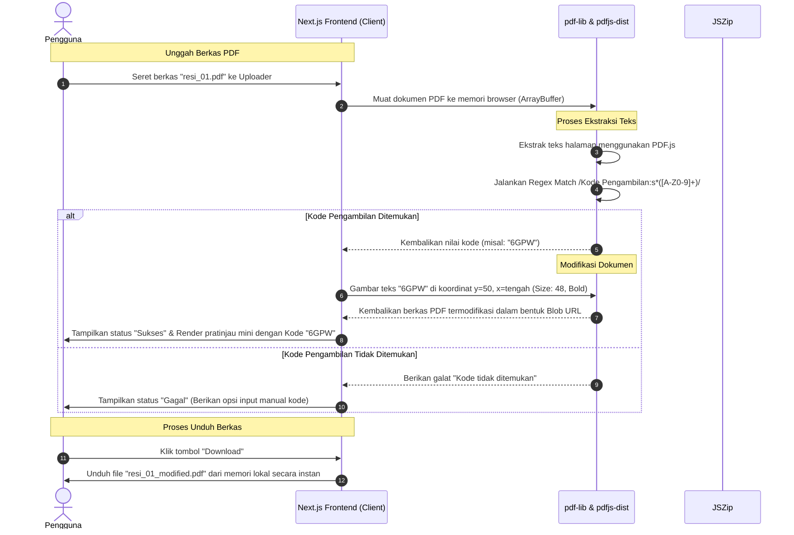
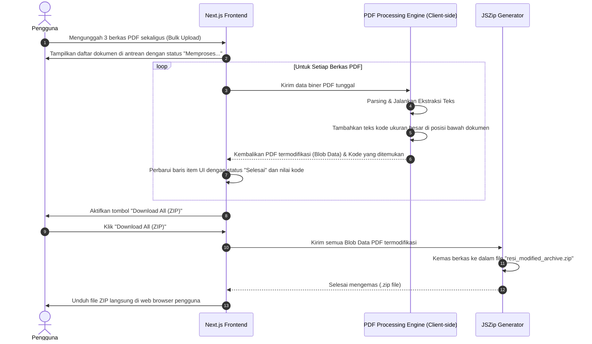
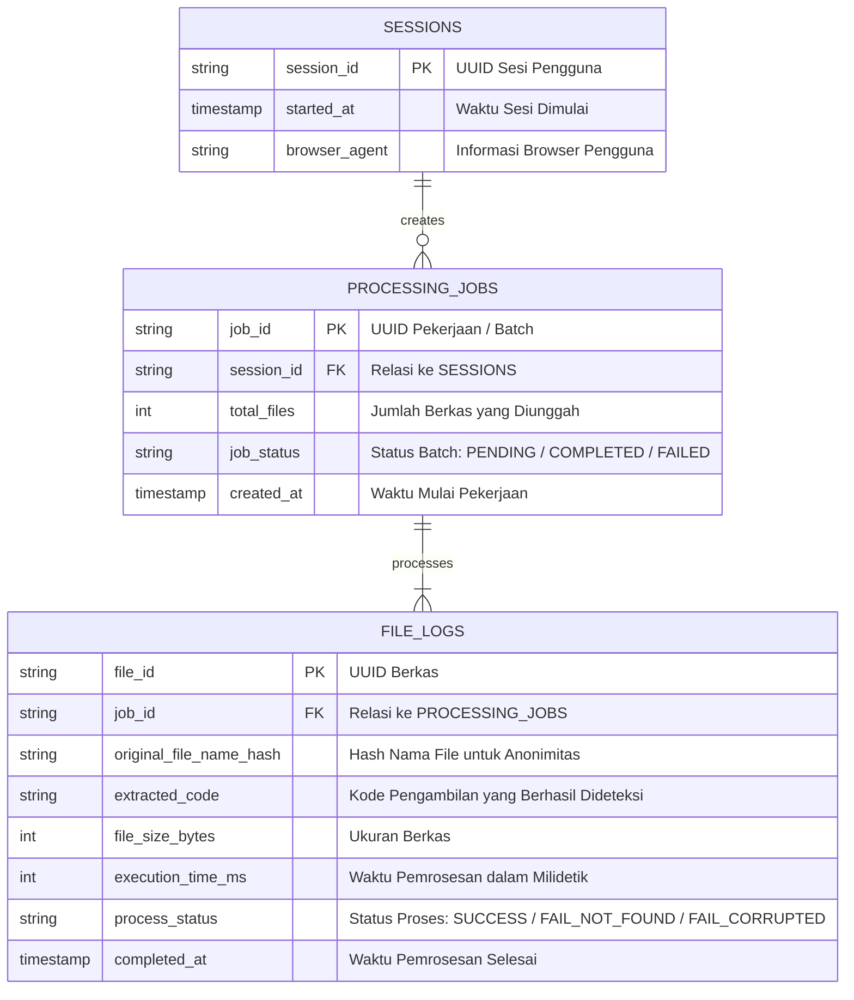

# PRD — Project Requirements Document

## 1. Overview

### Visi Proyek
Membangun aplikasi web berbasis Next.js yang efisien, intuitif, dan responsif untuk mengotomatisasi modifikasi resi pengiriman PDF. Aplikasi ini dirancang untuk membaca dokumen resi, mengekstrak "Kode Pengambilan", dan mencetaknya kembali dengan ukuran sangat besar (dominan, tebal, rata tengah) di area kosong bagian bawah dokumen guna mempermudah keterbacaan kode dari jarak jauh oleh staf gudang dan kurir lapangan.

### Masalah yang Ingin Dipecahkan
1. **Keterbatasan Visibilitas Kode:** "Kode Pengambilan" pada resi pengiriman standar biasanya berukuran sangat kecil, sehingga menyulitkan petugas gudang dalam mencari, mengelompokkan, dan menyerahkan paket dengan cepat.
2. **Proses Manual yang Lambat:** Menulis ulang kode pengambilan secara manual menggunakan spidol pada paket atau dokumen memakan waktu lama dan rentan terhadap kesalahan manusia (*human error*).
3. **Penurunan Kualitas Dokumen:** Konversi PDF menjadi gambar untuk diedit sering kali memecah resolusi barcode asli, membuat barcode tidak dapat dipindai (*unscannable*) saat dicetak.

### Target Pengguna (User Personas)
* **Staff Gudang / Sortir:** Pengguna yang memproses puluhan hingga ratusan resi pengiriman setiap harinya sebelum proses distribusi fisik.
* **Kurir / Driver Hub:** Pengguna lapangan yang membutuhkan verifikasi cepat atas kode pengambilan barang dari jarak pandang yang tidak terlalu dekat.

---

## 2. Requirements

### Functional Requirements

| ID | Deskripsi Kebutuhan Fungsional |
| :--- | :--- |
| **FR-01** | Sistem harus menyediakan komponen unggah (*uploader*) dengan dukungan seret-lepas (*drag-and-drop*) untuk file berformat `.pdf`. |
| **FR-02** | Sistem harus mendukung pengunggahan banyak file sekaligus (*bulk upload*) untuk efisiensi pemrosesan massal. |
| **FR-03** | Sistem harus secara otomatis memindai teks PDF dan mengekstrak nilai alfanumerik yang berada tepat di sebelah kanan teks label `"Kode Pengambilan:"` (Contoh: "6GPW"). |
| **FR-04** | Sistem harus menolak file selain PDF dan memberikan notifikasi kesalahan (*error handling*) jika pola kata kunci target tidak ditemukan. |
| **FR-05** | Sistem harus memodifikasi halaman PDF asli dengan menyisipkan teks kode hasil ekstraksi ke area kosong di bagian bawah halaman. |
| **FR-06** | Teks hasil modifikasi di bagian bawah harus memiliki spesifikasi visual: ukuran sangat besar (minimum 48pt), tebal (*bold*), dan rata tengah (*center-aligned*). |
| **FR-07** | Hasil modifikasi wajib mempertahankan ketajaman elemen asli dokumen, termasuk kualitas barcode dan detail teks alamat agar tidak pecah saat dicetak. |
| **FR-08** | Sistem harus menyediakan tombol aksi "Download" individual untuk setiap file dan tombol "Download All" (dalam bentuk format `.zip` atau unduhan sekuensial) untuk pemrosesan massal. |

### Non-Functional Requirements

| Kategori | Parameter Kebutuhan |
| :--- | :--- |
| **Performance** | - Waktu ekstraksi dan modifikasi satu dokumen PDF harus selesai dalam waktu kurang dari 2 detik sejak berkas selesai diunggah. |
| **Security & Privacy** | - Aplikasi harus memproses dokumen secara *stateless* (idealnya di sisi klien / *client-side in-memory* menggunakan `pdf-lib` atau langsung dihapus dari memori server setelah selesai diunduh) untuk menjamin keamanan data pengiriman konsumen. |
| **Compatibility** | - PDF keluaran harus kompatibel secara penuh dengan semua standar printer thermal dan printer laser kantor standar. |
| **Usability** | - Antarmuka pengguna harus bersih, minimalis, dan memberikan indikator progres visual (persentase) saat pemrosesan dokumen massal sedang berjalan. |

---

## 3. Core Features

| ID Fitur | Nama Fitur | Deskripsi Fitur | Prioritas | Estimasi Kompleksitas |
| :--- | :--- | :--- | :--- | :--- |
| **F-01** | Drag-and-Drop Uploader | Komponen area unggah yang menerima file `.pdf`, mendukung pemilihan banyak file (*multiple files selection*) dengan validasi tipe dokumen yang ketat. | High | Low |
| **F-02** | PDF Text Extraction Engine | Mesin ekstraksi teks berbasis kata kunci untuk memindai dokumen dan menggunakan ekspresi reguler (*Regular Expressions*) guna mengambil token alfanumerik unik setelah teks "Kode Pengambilan:". | High | Medium |
| **F-03** | Visual Overlay PDF Writer | Modul penyisipan teks yang menempelkan kembali string kode yang diekstrak ke koordinat bagian bawah PDF asli dengan parameter gaya (Ukuran: 48-64px, Font: Helvetica-Bold, Align: Center). | High | High |
| **F-04** | Real-Time Processing Dashboard | Tabel antarmuka yang menampilkan status pemrosesan setiap file (Antre, Sedang Diproses, Sukses, Gagal), nama file, dan kode pengambilan yang berhasil diidentifikasi. | High | Medium |
| **F-05** | Bulk Export Manager | Fitur ekspor berkas pintar untuk mengunduh seluruh PDF hasil modifikasi dalam satu paket arsip ZIP tanpa merusak integritas file. | Medium | Medium |

---

## 4. User Flow

```
[Mulai]
   │
   ▼
1. Pengguna membuka Aplikasi Modifikasi Resi PDF
   │
   ▼
2. Pengguna menyeret/memilih satu atau beberapa file PDF resi asli ke area Uploader
   │
   ▼
3. Sistem memvalidasi tipe file (.pdf)
   │
   ├── [File Tidak Valid] ──> Tampilkan Pesan Error & Batalkan unggahan
   │
   └── [File Valid]
           │
           ▼
4. Sistem mengekstrak teks halaman PDF & mencari kata kunci "Kode Pengambilan:"
   │
   ├── [Kode Tidak Ditemukan] ──> Tampilkan status "Kode Gagal Diekstrak"
   │                              pada baris file tersebut di dashboard
   │
   └── [Kode Ditemukan (misal: "6GPW")]
           │
           ▼
5. Sistem menyisipkan teks "6GPW" berukuran besar & tebal di area bawah halaman PDF
   │
   ▼
6. Sistem memperbarui baris status di UI menjadi "Selesai" dan menampilkan Kode Pengambilan yang dideteksi
   │
   ▼
7. Pengguna klik tombol "Download" (untuk file tunggal) atau "Download All" (untuk ZIP massal)
   │
   ▼
8. Sistem mengunduh PDF hasil modifikasi berkualitas tinggi yang siap dicetak
   │
   ▼
[Selesai]
```

---

## 5. Architecture

Sistem ini diimplementasikan menggunakan framework **Next.js** (App Router). Untuk memastikan kinerja maksimum, efisiensi bandwidth, dan privasi data terbaik, proses ekstraksi dan modifikasi PDF dilakukan secara langsung pada sisi klien (*Client-side Processing*) menggunakan pustaka `pdf-lib` dan `pdfjs-dist`. Namun, Next.js API Routes disediakan sebagai lapisan alternatif (*fallback*) jika ditemui dokumen kompleks yang membutuhkan daya komputasi di sisi server.



---

## 6. Sequence Diagram

Berikut adalah alur sequence diagram terperinci untuk pemrosesan banyak berkas (*bulk upload*) yang melibatkan pembuatan bundel ZIP di sisi klien sebelum pengunduhan.



---

## 7. Database Schema

Meskipun pemrosesan dokumen bersifat *stateless* dan dilakukan langsung pada memori perangkat pengguna demi menjaga privasi penuh konten resi, sistem menyediakan skema pelacakan transaksi (*audit logging*) sederhana. Basis data ini hanya menyimpan metadata aktivitas pemrosesan tanpa menyimpan konten sensitif atau salinan berkas PDF asli.



### Detail Deskripsi Entitas Log Pelacakan

#### 1. Tabel: `SESSIONS`
Menyimpan data sesi pengguna yang mengakses aplikasi untuk keperluan analisis demografi penggunaan.
* `session_id` (Type: `VARCHAR`): UUID unik yang dibuat otomatis saat pengguna membuka aplikasi pertama kali.
* `started_at` (Type: `TIMESTAMP`): Catatan waktu kapan sesi dimulai.
* `browser_agent` (Type: `VARCHAR`): Informasi browser yang digunakan untuk optimasi kecocokan fitur render PDF.

#### 2. Tabel: `PROCESSING_JOBS`
Menampung riwayat pekerjaan unggah massal yang dilakukan oleh pengguna.
* `job_id` (Type: `VARCHAR`): ID unik untuk menandai satu siklus proses unggah (bisa terdiri dari banyak file).
* `session_id` (Type: `VARCHAR`): Kunci asing yang menghubungkan pekerjaan ke sesi tertentu.
* `total_files` (Type: `INT`): Jumlah berkas yang ada di dalam antrean unggahan tersebut.
* `job_status` (Type: `VARCHAR`): Status final dari pekerjaan tersebut (misal: "COMPLETED").

#### 3. Tabel: `FILE_LOGS`
Menyimpan riwayat performa sistem dan kesuksesan ekstraksi tiap berkas tanpa menyimpan berkas fisik PDF demi keamanan privasi.
* `file_id` (Type: `VARCHAR`): ID unik setiap berkas.
* `job_id` (Type: `VARCHAR`): Kunci asing yang merujuk pada `PROCESSING_JOBS`.
* `original_file_name_hash` (Type: `VARCHAR`): Enkripsi hash SHA-256 nama file asli untuk analisis debug tanpa mengekspos nama file aslinya.
* `extracted_code` (Type: `VARCHAR`): Kode Pengambilan hasil ekstraksi (misal: "6GPW") untuk memantau tren efisiensi ekstraksi OCR/Text.
* `file_size_bytes` (Type: `INT`): Ukuran berkas PDF asli.
* `execution_time_ms` (Type: `INT`): Kecepatan waktu pemrosesan berkas.

---

## 8. Tech Stack

* **Framework Utama:** Next.js 14 (App Router) untuk penataan halaman web, rute API fallback yang efisien, dan komponen UI yang cepat.
* **UI Styling:** Tailwind CSS dan shadcn/ui untuk mempercepat desain antarmuka yang modern, bersih, dan responsif.
* **Uploader Library:** React Dropzone untuk komponen drag-and-drop file dengan fitur penanganan multi-file yang stabil.
* **PDF Parsing & Rendering (Client-Side):**
  * `pdfjs-dist` (PDF.js oleh Mozilla) untuk memindai dokumen dan melakukan pembacaan teks karakter dalam PDF secara berurutan.
  * `pdf-lib` untuk memodifikasi file PDF yang ada, menyisipkan teks dengan gaya kustom, menentukan koordinat letak teks, dan mengekspor hasilnya dalam format biner yang bersih.
* **Bulk Download Packager:** `JSZip` untuk membungkus seluruh file biner hasil modifikasi menjadi berkas `.zip` secara dinamis di sisi browser sebelum diunduh oleh pengguna.
* **Hosting & Infrastruktur:** Vercel untuk penyebaran yang andal, berlatensi rendah, serta memiliki sistem skalabilitas serverless yang baik.